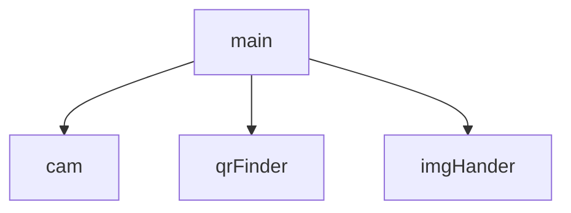
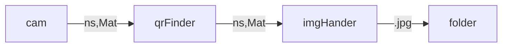

# image-grabber

It grabs the images which have specific qr values and saves to specific folder in jpg format

## Thread spawn



## Flow of message between thread


## Usage

```
build/image-grabber --help
```

```
./build/image_grabber --cam 0 --fps 10 --width 1280 --height 720 --dir "images" --qr "yes" --qr "qr2" --qr "st3"
```

## compilation

opencv and zbar development package must be installed in the machine

### to create image-grabber

```
make
```

### to clean 

```
make clean
```


## documentation

doxygen generated document is present in docs folder


### generate document after doing changes

```
doxygen doxygen.config
```
